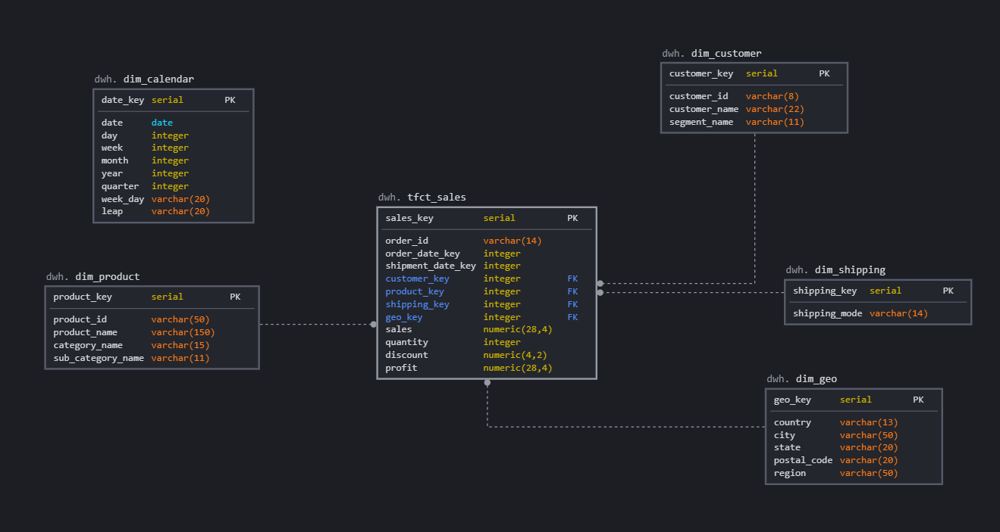

# Module 2

## Creating a staging layer and importing raw data

- [stg.orders.sql](stg.orders.sql)
- [stg.people.sql](stg.people.sql)
- [stg.returns.sql](stg.returns.sql) 

## Creating a new layer DWH. Loading data (stg -> dwh)

- [create_and_fill_tables.sql](create_and_fill_tables.sql)

## Data model in SQLdbm

## Graphs using QuickSignt

## Graphs using KlipFolio

