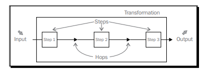

# Database sample for the modules 8-9 of Pentaho DI Beginners Guide
Download DB sample [here](https://sourceforge.net/projects/pentaho/files/Business%20Intelligence%20Server/1.7.1-stable/)

# Inside Pentaho DI

## Transformation
A transformation is an entity made of steps linked by hops. These steps and hops build paths
through which data flows—the data enters or is created in a step, the step applies some
kind of transformation to it, and finally the data leaves that step. Therefore, it’s said that
a transformation is data flow oriented.

A transformation itself is neither a program nor an executable file. It is just plain XML.
The transformation contains metadata which tells the Kettle engine what to do.

## Step
A step is the minimal unit inside a transformation. A big set of steps is available. These steps
are grouped in categories such as the Input and Flow categories that you saw in the example.

Each step is conceived to accomplish a specific function, going from reading a parameter
to normalizing a dataset.

Each step has a configuration window. These windows vary according to the functionality
of the steps and the category to which they belong. What all steps have in common are
the name and description:

## Hop
A hop is a graphical representation of data flowing between two steps: an origin and a
destination. The data that flows through that hop constitute the output data of the origin
step and the input data of the destination step.

# Pentaho ETL Subsystems
## Extraction
*Getting the data from the various source systems*
1.  Data Profiling System
2. Change Data Capture System
3. Extraction System

## Cleaning and Conforming Data
*Transforming and integrating the data to prepare it for the data warehouse*
4. Data Cleaning and Quality Screen Handler System
5. Error Event Handler
6. Audit Dimension Assembler
7. Deduplication System
8. Data Conformer

## Data Delivery
*Loading and updating the data in the data warehouse*
9. Slowly Changing Dimension Processor
10. Surrogate Key Creation System
11. Hierarchy Dimension Builder
12. Special Dimension Builder
13. Fact Table Loader
14. Surrogate Key Pipeline
15. Multi-Valued Dimension Bridge Table Builder
16. Late-Arriving Data Handler
17. Dimension Manager System
18. Fact Table Provider System
19. Aggregate Builder
20. Multidimensional (OLAP) Cube Builder
21. Data Integration Manager

## Managing the ETL Environment
*Controlling and monitoring the correct processing of all components of the ETL solution*
22. Job Scheduler
23. Backup System
24. Recovery and Restart System
25. Version Control System
26. Version Migration System from development to test to production
27. Workflow Monitor
28. Sort System
29. Lineage and Dependency Analyzer
30. Problem Escalation System
31. Parallelizing/Pipelining System
32. Security System
33. Compliance Reporter
34. Metadata Repository Manager