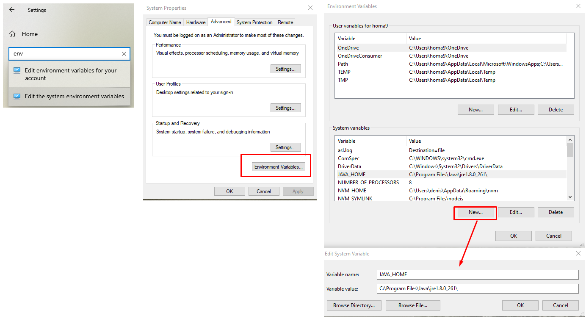
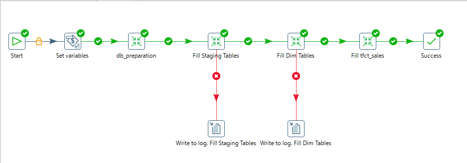
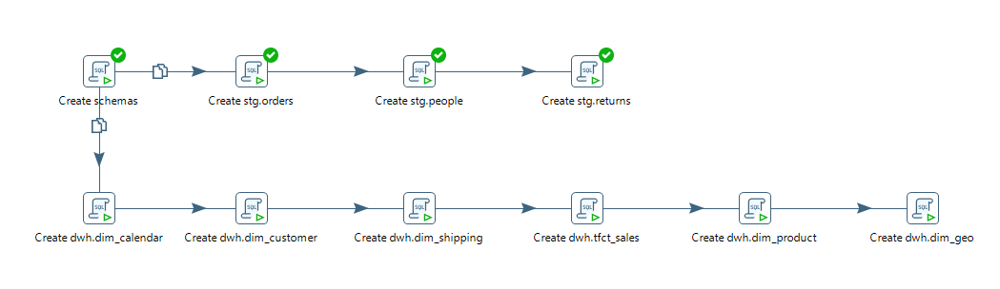
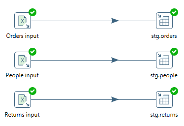
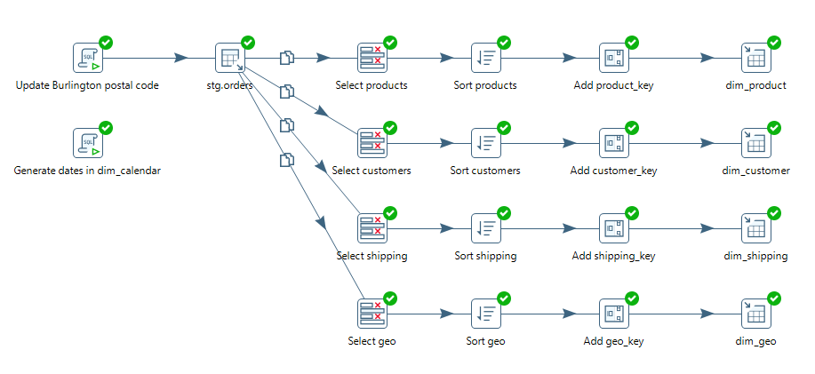
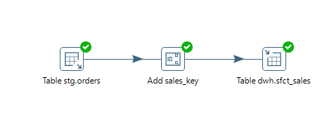

## Pentaho DI installation
1. [Download](https://sourceforge.net/projects/pentaho/) and extract Pentaho DI
2. [Download](https://downzen.com/en/windows/java-runtime-environment/download/8-update-261/) and install Java 8 ver.261
3. Set the Environment Variable JAVA_HOME 
«Settings» → Find «Edit environment variables for your account» 
Click «Environment Variables…» button 
Click «New...» under «System variables» and create a new variable with the name JAVA_HOME and value -  JRE installation path  

4. Run *Spoon.bat*.
5. *Tip*. Create a shortcut of *Spoon.bat* in order to pint in to Start. Target:
*C:\Windows\System32\cmd.exe /c "C:\...\pdi-ce-9.1.0.0-324\data-integration\Spoon.bat"*
   
# Sample Superstore ETL process

**1. db_preparation **

**2. Fill Staging Tables ** 

**3. Fill Dim Tables **

**4. Fill tfct_sales **

## Refference
- [Pentaho DI documentation](https://wiki.pentaho.com/display/EAI/Pentaho+Data+Integration+Steps)
- [Pentaho DI Steps Guide (Rus)](https://medium.com/@romangailit/pentaho-di-steps-guide-faada864b3e)  by romangailit (draft)