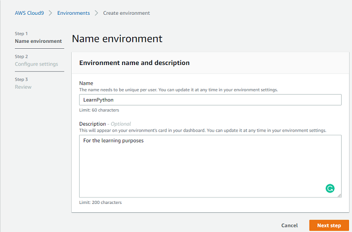

**Content**
* [Create a new environment in AWS Cloud9](#Create a new environment in AWS Cloud9)
* [1](#1)
    * [1.1](#1.1)
    * [1.2](#1.2)
    * [1.3](#1.3)
    
# Create a new environment in AWS Cloud9
1. Log in to your AWS account
2. Find *Cloud9* among all services 

3. Create a new AWS Cloud9 environment 

4. Give it a name and description 

5. Configure settings (keep the default setting) 

6. Review and create environment 

**Tip**. If there is an error like this *Unable to access your environment The environment creation failed with the error: The development environment...* try to change your location.