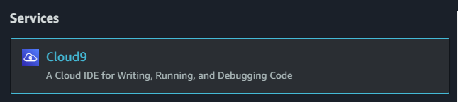
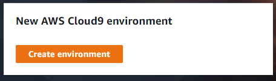
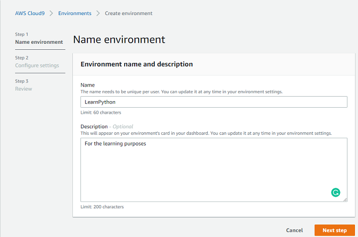
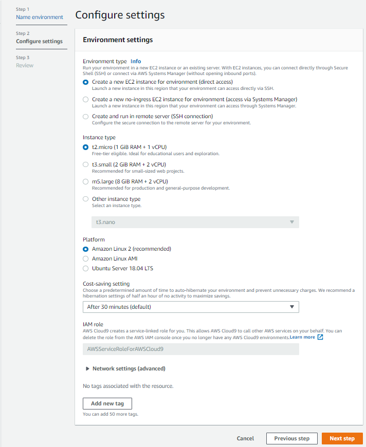
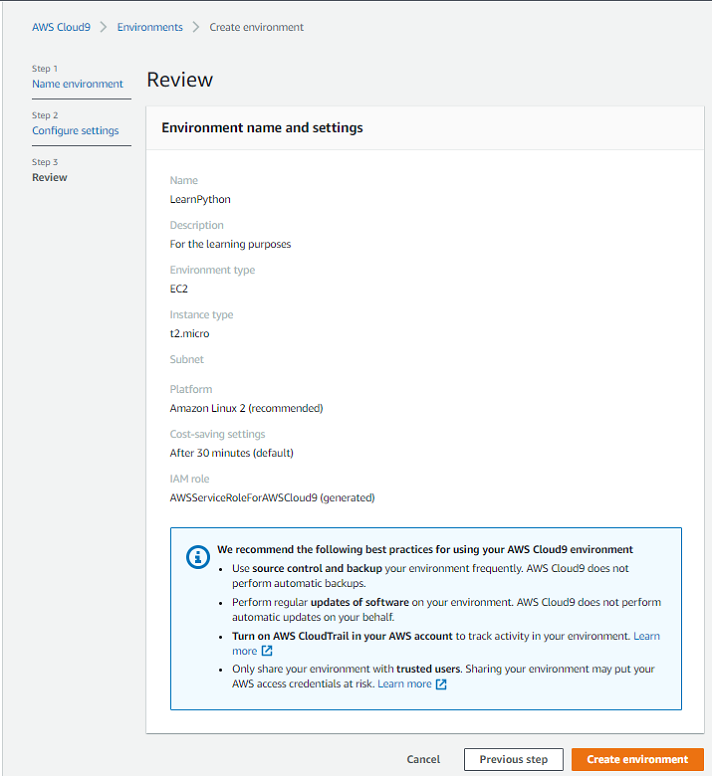
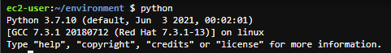

Link to the exercises - *[Learn Python On AWS Workshop](https://learn-to-code.workshop.aws/)*

**Content**
* [x] [Setup](#1.-Setup) 
* [x] [Getting started](#2.-Getting-started)
  * [x] [Cloud9](#2.1.-Create-a-new-environment-in-AWS-Cloud9)
  * [x] [Python Version](#2.2.-Python-version)
  * [x] Virtual Environment
* [x] Variables
* [ ] Data types
  * [ ] [Strings](##4.1-Strings)
  * [ ] [Numbers](##4.2 Numbers)
  * [ ] Dictionaries
  * [ ] Lists
  * [ ] Determining Type
* [ ] Python Packages
    * [ ] 
* [ ] Functions
* [ ] Arguments and Parameters
* [ ] Inputs
* [ ] Loops
* [ ] If Statements
* [ ] Logging
* [ ] Errors and Exceptions
* [ ] Persisting Data
* [ ] Building in AWS
* [ ] Clean Up
* [ ] Congratulations

#1. Setup

Used: AWS Cloud9

#2. Getting started

##2.1. Create a new environment in AWS Cloud9
1. Log in to your AWS account
2. Find *Cloud9* among all services<br>

3. Create a new AWS Cloud9 environment<br>

4. Give it a name and description<br>

5. Configure settings (keep the default setting, so you won't be charged)<br>

6. Review and create environment<br>


**Tip**. If there is an error like this *Unable to access your environment The environment creation failed with the error: The development environment...* try to change your location.

##2.2. Python version


##2.3. Virtual Environment
To create a virtual environment we will use the command:
```python
python -m venv my_venv
```
To activate the environment use the following command (Linux):
```python
source my_venv/bin/activate
```
##4.1 Strings
###Using Variables in Strings
####.format()
```python
first_name = "John"
surname = "Doe"
print("My first name is {}. My family name is {}".format(first_name, surname))
```
####f strings
```python
firstname = "Jane"
surname = "Doe"
print(f"My first name is {firstname}. My family name is {surname}")
```
##4.2 Numbers
* str() returns a string object
* int() returns an integer object
* float() returns a floating point object
* bool() a boolean value of True or False
